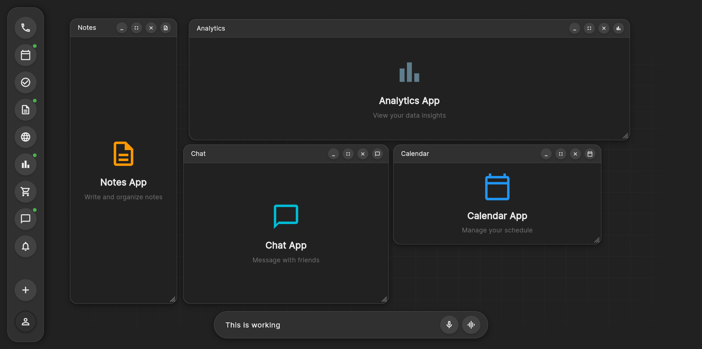

# VOS Frontend

[](https://flutter.dev)
[](https://dart.dev)
[](https://openai.com)
[](https://claude.ai/code)

A modern **Virtual Operating System** interface built with Flutter, featuring a sleek dark theme, AI-powered workspace, and elegant modal window management.



## 🌟 What is VOS?

VOS (Virtual Operating System) is a cutting-edge Flutter web application that simulates a modern operating system interface within your browser. It features:

- **🎨 Dark Modern Design** - Elegant UI with subtle bevels, shadows, and VOS design system
- **📱 Modal App Management** - Up to 4 concurrent apps with drag, resize, minimize, and fullscreen
- **🎯 Smart App Rail** - Interactive launcher with visual state indicators
- **⚡ High Performance** - Optimized animations and efficient state management
- **🖥️ Responsive Workspace** - Grid-based workspace with smooth fade effects

## 🚀 Quick Start

### Prerequisites
- Flutter SDK 3.0+
- Modern web browser (Firefox recommended for best performance)

### Installation & Launch

1. **Clone the repository:**
```bash
git clone https://github.com/yourusername/VOS_frontend.git
cd VOS_frontend
```

2. **Install dependencies:**
```bash
flutter pub get
```

3. **🎯 Launch VOS (Recommended):**
```bash
flutter run -d web-server --web-port=8080
```

4. **Open in your browser:**
Navigate to **http://localhost:8080** in Firefox or Chrome

> **💡 Pro Tip:** Use Firefox for optimal performance, or try `--profile` mode for faster Chrome experience.

## 🏗️ Architecture & Components

### Core Components

- **🎛️ AppRail** - Left navigation with 9 app launchers (Phone, Calendar, Tasks, Notes, Browser, Analytics, Shop, Chat, Notifications)
- **🖼️ VosModal** - Draggable, resizable modal windows with window controls
- **🌐 Workspace** - Grid background with edge fade effects
- **🔔 Smart Notifications** - Elegant 4-modal limit warnings
- **⚡ Modal Manager** - Production-grade state management system

### Design System

- **Colors**: Dark theme (`#212121` background, `#303030` surfaces, `#EDEDED` text)
- **Typography**: Clean, consistent text hierarchy
- **Shadows**: Dual-layer shadow system for depth
- **Icons**: Material Design outlined icons with circular backgrounds
- **Animations**: Smooth 150ms transitions with proper easing

## 🎮 Features

### ✨ Modal Window System
- **4 Concurrent Apps** - Maximum productivity without clutter
- **Drag & Drop** - Smooth repositioning within workspace bounds
- **Resize Controls** - Bottom-right corner resize handles
- **Window States** - Normal, minimized, fullscreen modes
- **Smart Positioning** - Auto-cascading placement for new windows

### 🎯 App Management
- **Visual Indicators** - Green dots (open), orange pulsing dots (minimized)
- **One-Click Launch** - Instant app opening from rail
- **State Persistence** - Remembers window positions and states
- **Limit Protection** - Elegant notifications prevent system overload

### 🎨 Performance Optimizations
- **Efficient Rebuilds** - Strategic widget isolation and caching
- **Controlled Animations** - Managed animation lifecycles
- **Smart State Management** - Change detection and minimal notifications
- **Memory Management** - Proper disposal and cleanup

## 🛠️ Development

### Project Structure
```
lib/
├── core/
│   ├── modal_manager.dart     # State management for modals
│   └── themes/               # VOS design system
├── presentation/
│   ├── widgets/
│   │   ├── app_rail.dart     # Left navigation rail
│   │   ├── vos_modal.dart    # Modal window component
│   │   ├── workspace.dart    # Grid background workspace
│   │   └── app_icon.dart     # Enhanced app launcher icons
│   └── pages/
│       └── home/             # Main application layout
```

### Key Technologies
- **Flutter Web** - Cross-platform UI framework
- **Custom State Management** - Optimized ChangeNotifier pattern
- **Custom Painting** - Grid backgrounds and resize handles
- **Gesture Detection** - Advanced drag, resize, and hover handling

## 🧪 Testing & Performance

### Launch Options
```bash
# Development (slower but with hot reload)
flutter run -d web-server --web-port=8080

# Profile mode (faster performance)
flutter run -d web-server --web-port=8080 --profile

# Different renderers
flutter run -d chrome --dart-define=FLUTTER_WEB_USE_SKIA=true   # CanvasKit
flutter run -d chrome --dart-define=FLUTTER_WEB_USE_SKIA=false  # HTML
```

### Performance Tips
- **Use Firefox** for best Flutter web performance
- **Close browser DevTools** during testing
- **Try Profile Mode** for production-like performance
- **Disable browser extensions** that might interfere

## 📱 Browser Compatibility

| Browser | Performance | Features | Recommended |
|---------|-------------|----------|-------------|
| Firefox | ⭐⭐⭐⭐⭐ | Full | ✅ Yes |
| Chrome | ⭐⭐⭐ | Full | ⚠️ Use --profile |
| Safari | ⭐⭐⭐ | Full | ✅ Good |
| Edge | ⭐⭐⭐⭐ | Full | ✅ Good |

---

**Built with Flutter** | **Experience the future of virtual operating systems**


flutter pub run build_runner build --delete-conflicting-outputs
flutter build web
flutter run -d web-server --web-port=8090

docker compose -f docker-compose.backend-only.yml up -d --build 


Username: admin / Password: admin123
Username: user1 / Password: password1
